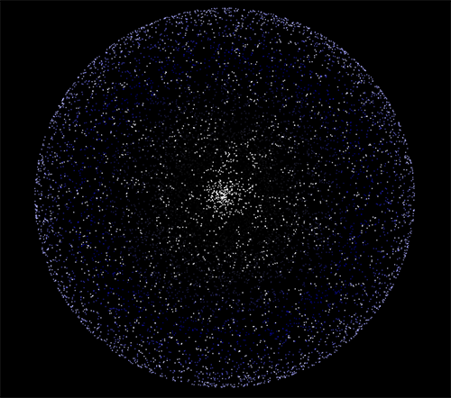

N-Body Simulation
======================

Made using OpenCL so all the calculations run on a GPU.

[Video](https://www.youtube.com/watch?v=teazZR58TOs)    
[Download](../../downloads/Release-win-x64.zip)    

[AMD APP SDK (OpenCL)](http://developer.amd.com/tools-and-sdks/heterogeneous-computing/amd-accelerated-parallel-processing-app-sdk/)     
[Freeglut](http://freeglut.sourceforge.net/)     
[GLEW](http://glew.sourceforge.net/)

If there are any missing dll errors, please install [Visual C++ Redistributable Packages for Visual Studio 2013](http://www.microsoft.com/en-us/download/details.aspx?id=40784)